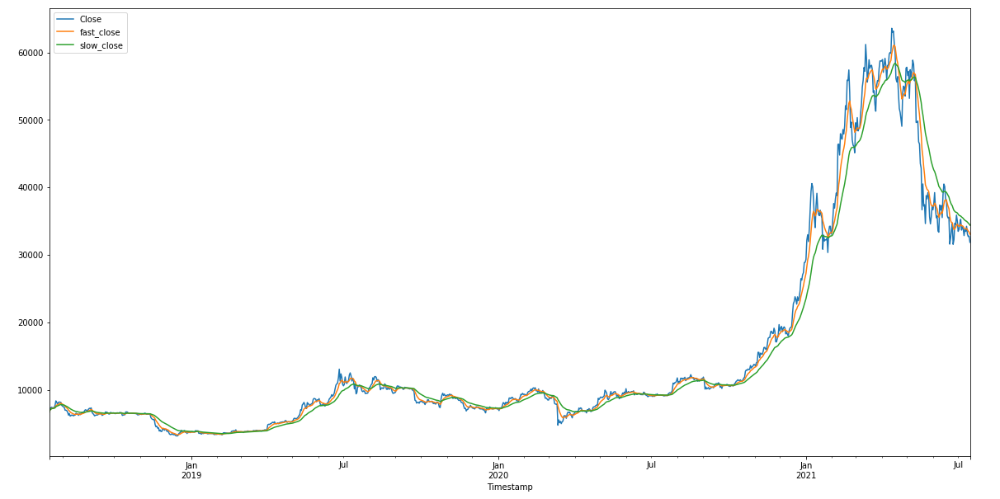
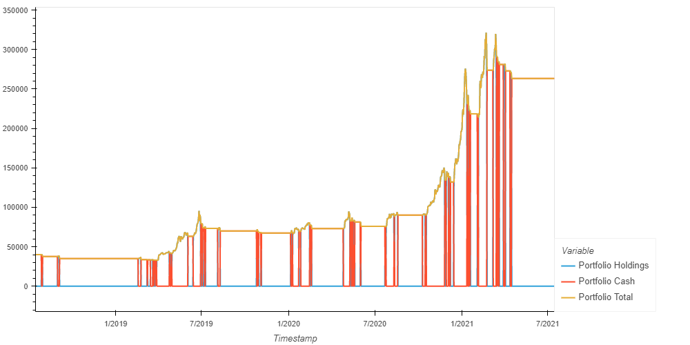
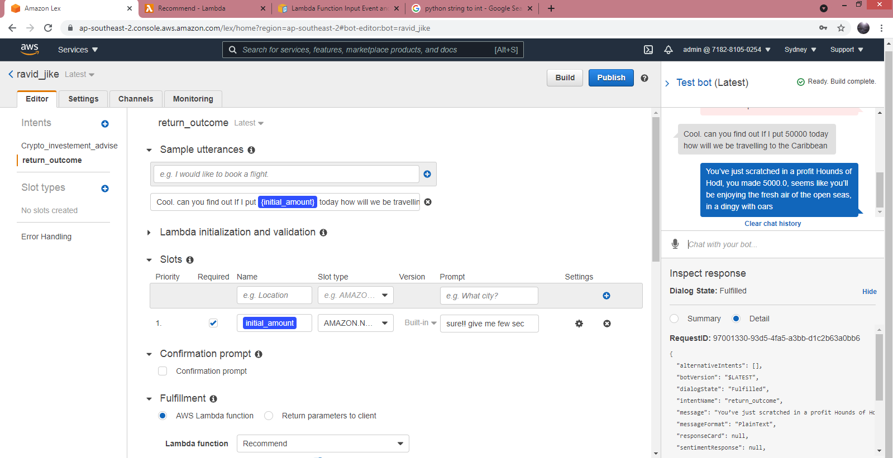

# Project #2 - Algo Trading + Lex Bot

## Premise: 

Set up a successful trading algorithm

## Team: 

Mike Rae, John Lardis, Raj Mohapatro, David Spring

## Main working files
CCXT_Strategy_Main_LT - Final
CCXT_Strategy_Main_ST - Final

Archive is files used in project for research and workings but no longer required

Model built in Jupyter Notebook

Machine Learning Models applied scikit-learn

## General Overview:
Raw Data pulled in from CCXT
Cleaned and processed
Date ranges and timeframes set
Fitting of the models 
Visualisations, analysis and evaluations applied
Random Forest Training on 80% data, testing on 20% (new data)
Relevant PNG's saved into repo folder
Additional ML evaluation metric Log_Loss imported and used for evaluation of Random Forest models
Readme prepared

Indicators used: EWM, SMA, Bollinger Bands, Volatility, RSI, Random Forest Classifier

Lex Bot built using Amazon Lex V1

## Findings Summary 

Long term performed much better than short term but market was noted to be in an uptrend

The best long term performing model was EMW resulting in a portfolio value of $390K ( 870% ROI

The worst performing long term performing model was Bollinger Bands resulting in a portfolio value of $162K (303%) 

The best log loss in both short term and long term - RF5 @ 0.95

For the short term strategy - smaller windows resulted in more frequent entry/exit with improved performance

The range of results for the short term varied from positive to negative returns

Target positive return was reduced in the RF short term model to improve results 

The use of Entry/Exit point vs Signals improved the performance of Random Forest Models 

Changes in time frame results in large variations - e.g changing date parameters

## Image examples below:

EWM Long Term Model Chart Example:

EWM Long Term Model Portfolio Holdings Example:

Lambda and Lex Bot Integration Example:

